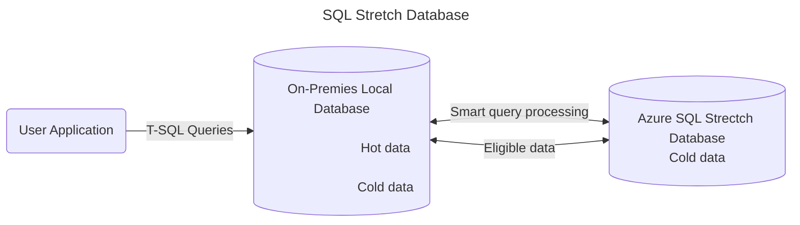

# Introduce
## 1. Public Cloud
> The public cloud is defined as computing service offered by third-party provider over the public Internet,
 making them available to anyone who wants to use or purchase them.
## 2. Private Cloud
> The private cloud is defined as computing service offered either over the Internet or private internal network
>  and only to select users instead of the genaral public. 
## 3. Hybrid Cloud
> The hybrid cloud is a computing enviroment that combines a private cloud with a public cloud.

Example

# Compare and constrast
